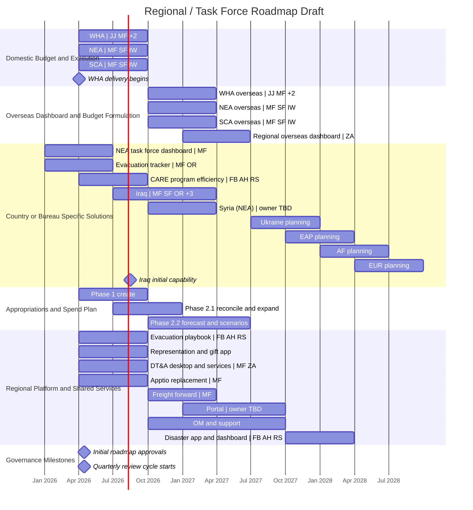

```mermaid
gantt
    title Regional / Task Force Roadmap Draft
    dateFormat  YYYY-MM-DD
    axisFormat  %b %Y

    section Domestic Budget and Execution
    WHA | JJ MF +2                       :wha_dom, 2026-04-01, 2026-09-30
    NEA | MF SF IW                      :nea_dom, 2026-04-01, 2026-09-30
    SCA | MF SF IW                      :sca_dom, 2026-04-01, 2026-09-30
    WHA delivery begins                 :milestone, 2026-04-01, 1d

    section Overseas Dashboard and Budget Formulation
    WHA overseas | JJ MF +2             :wha_ovr, 2026-10-01, 2027-03-31
    NEA overseas | MF SF IW             :nea_ovr, 2026-10-01, 2027-03-31
    SCA overseas | MF SF IW             :sca_ovr, 2026-10-01, 2027-03-31
    Regional overseas dashboard | ZA    :reg_dash, 2027-01-01, 2027-06-30

    section Country or Bureau Specific Solutions
    NEA task force dashboard | MF       :task_force, 2026-01-01, 2026-06-30
    Evacuation tracker | MF OR          :evac, 2026-01-01, 2026-06-30
    CARE program efficiency | FB AH RS  :care_eff, 2026-04-01, 2026-09-30
    Iraq | MF SF OR +3                  :iraq, 2026-07-01, 2027-03-31
    Syria (NEA) | owner TBD             :syria, 2026-10-01, 2027-03-31
    Ukraine planning                    :ukraine, 2027-07-01, 2027-12-31
    EAP planning                        :eap, 2027-10-01, 2028-03-31
    AF planning                         :af, 2028-01-01, 2028-06-30
    EUR planning                        :eur, 2028-04-01, 2028-09-30
    Iraq initial capability             :milestone, 2026-08-15, 1d

    section Appropriations and Spend Plan
    Phase 1 create                      :sp1, 2026-04-01, 2026-09-30
    Phase 2.1 reconcile and expand      :sp21, 2026-07-01, 2026-12-31
    Phase 2.2 forecast and scenarios    :sp22, 2026-10-01, 2027-06-30

    section Regional Platform and Shared Services
    Evacuation playbook | FB AH RS      :playbook, 2026-04-01, 2026-09-30
    Representation and gift app         :gift, 2026-04-01, 2026-09-30
    DT&A desktop and services | MF ZA   :dta, 2026-04-01, 2026-09-30
    Apptio replacement | MF             :apptio, 2026-04-01, 2026-09-30
    Freight forward | MF                :freight, 2026-10-01, 2027-03-31
    Portal | owner TBD                  :portal, 2027-01-01, 2027-09-30
    OM and support                      :support, 2026-10-01, 2027-09-30
    Disaster app and dashboard | FB AH RS :disaster, 2027-10-01, 2028-03-31

    section Governance Milestones
    Initial roadmap approvals           :milestone, 2026-04-15, 1d
    Quarterly review cycle starts       :milestone, 2026-04-15, 1d
```